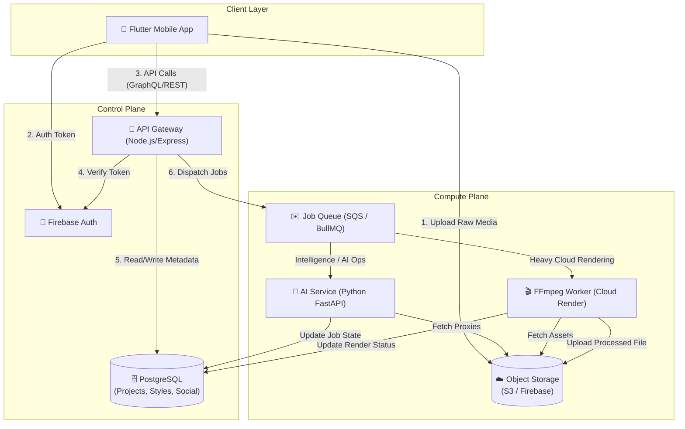

# Vexora Architecture Diagram

This diagram outlines the target system architecture across client, gateway, and service compute layers.

```mermaid
graph TD
    %% Clients
    Mobile["📱 Flutter Mobile App"]
    
    %% API Gateway Layer
    Gateway["🚪 API Gateway (Node.js/Express)"]
    Auth["🔐 Firebase Auth"]
    
    %% Async Infrastructure
    Queue["✉️ Job Queue (SQS / BullMQ)"]
    DB[("🗄️ PostgreSQL\n(Projects, Styles, Social)")]
    Storage[("☁️ Object Storage\n(S3 / Firebase)")]
    
    %% Compute Services
    AIWorker["🧠 AI Service (Python FastAPI)"]
    RenderWorker["🎬 FFmpeg Worker (Cloud Render)"]
    
    %% Connections
    Mobile -- "1. Upload Raw Media" --> Storage
    Mobile -- "2. Auth Token" --> Auth
    Mobile -- "3. API Calls (GraphQL/REST)" --> Gateway
    Gateway -- "4. Verify Token" --> Auth
    Gateway -- "5. Read/Write Metadata" --> DB
    Gateway -- "6. Dispatch Jobs" --> Queue
    
    Queue -- "Intelligence / AI Ops" --> AIWorker
    Queue -- "Heavy Cloud Rendering" --> RenderWorker
    
    AIWorker -- "Fetch Proxies" --> Storage
    AIWorker -- "Update Job State" --> DB
    
    RenderWorker -- "Fetch Assets" --> Storage
    RenderWorker -- "Upload Processed File" --> Storage
    RenderWorker -- "Update Render Status" --> DB
    
    %% Subgraphs for clarity
    subgraph "Client Layer"
        Mobile
    end
    
    subgraph "Control Plane"
        Gateway
        Auth
        DB
    end
    
    subgraph "Compute Plane"
        Queue
        AIWorker
        RenderWorker
        Storage
    end
```
