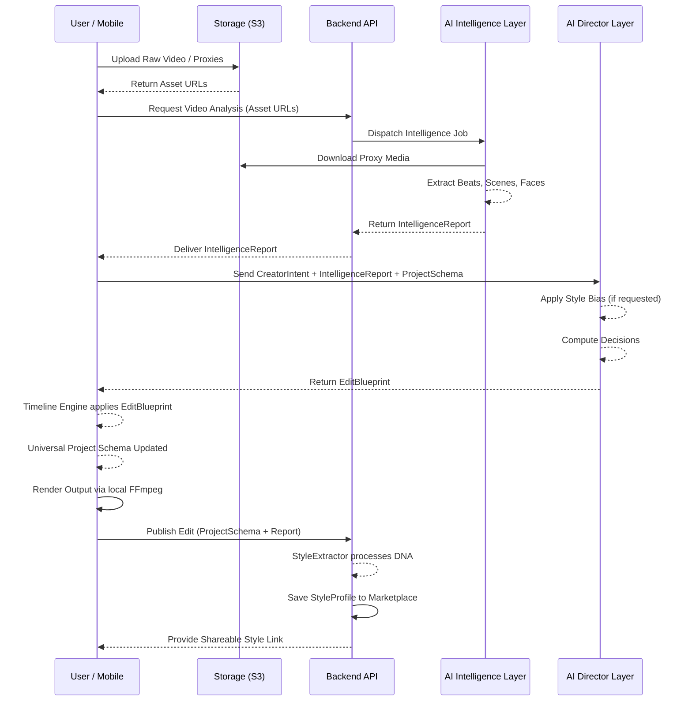

# Vexora Data Flow Diagram

This diagram visualizes the lifecycle of an edit, from video intelligence extraction to timeline rendering and Style DNA marketplace sharing.

```mermaid
sequenceDiagram
    participant U as User / Mobile
    participant S as Storage (S3)
    participant B as Backend API
    participant AI as AI Intelligence Layer
    participant DIR as AI Director Layer
    
    %% Upload Phase
    U->>S: Upload Raw Video / Proxies
    S-->>U: Return Asset URLs
    
    %% Intelligence Extraction
    U->>B: Request Video Analysis (Asset URLs)
    B->>AI: Dispatch Intelligence Job
    AI->>S: Download Proxy Media
    AI-->>AI: Extract Beats, Scenes, Faces
    AI-->>B: Return IntelligenceReport
    B-->>U: Deliver IntelligenceReport
    
    %% AI Editing Pipeline
    U->>DIR: Send CreatorIntent + IntelligenceReport + ProjectSchema
    DIR-->>DIR: Apply Style Bias (if requested)
    DIR-->>DIR: Compute Decisions
    DIR-->>U: Return EditBlueprint
    
    %% Local Application
    U-->>U: Timeline Engine applies EditBlueprint
    U-->>U: Universal Project Schema Updated
    U->>U: Render Output via local FFmpeg
    
    %% Marketplace Extraction (Phase 5)
    U->>B: Publish Edit (ProjectSchema + Report)
    B-->>B: StyleExtractor processes DNA
    B->>B: Save StyleProfile to Marketplace
    B-->>U: Provide Shareable Style Link
```
